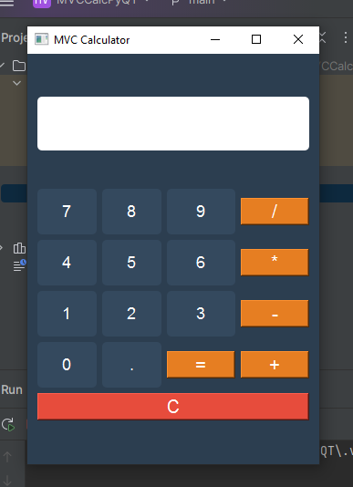
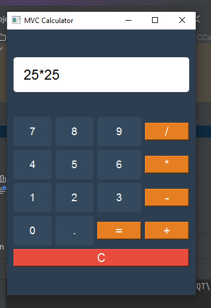
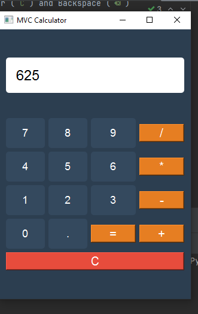

# PyQt MVC Calculator

A simple calculator built using the **Model-View-Controller (MVC)** pattern in Python with PyQt6.

## Features
✅ Basic arithmetic operations (+, -, *, /)  
✅ Decimal point support  
✅ Clear (`C`) and Backspace (`⌫`)  
✅ Styled UI with better visuals  

## Installation
1. Install dependencies:
pip install PyQt6
2. Run the application:
python controller.py
   
## Screenshots

## Author
Aidai 
